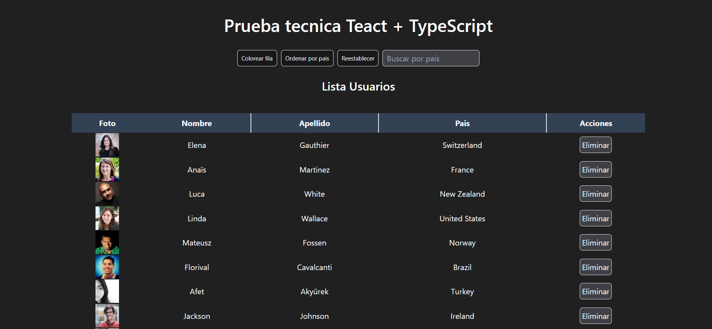

# Application

This is a React application that uses TypeScript.

## Installation

1. Clone this repository.
2. Run `pnpm install` to install the dependencies.

## Running the application

1. Run `pnpm run dev` to start the development server.
2. Open [http://localhost:5173](http://localhost:5173) to view the application in your browser.

## Features

- Fetches and displays a list of users from the [Random User API](https://randomuser.me/).
- Allows sorting and filtering of users by country.
- Allows toggling of row colors in the user list.
- Allows resetting of the user list to its original state.

## Contributing

Contributions are welcome. Please open an issue or submit a pull request if you would like to contribute.
